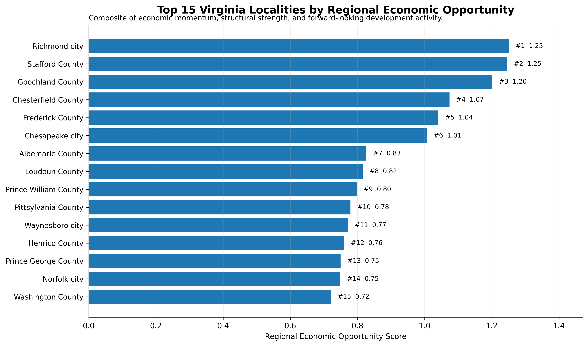
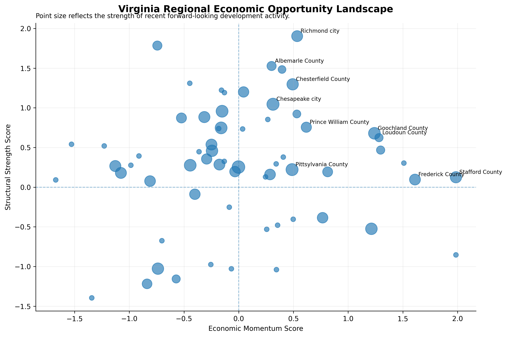
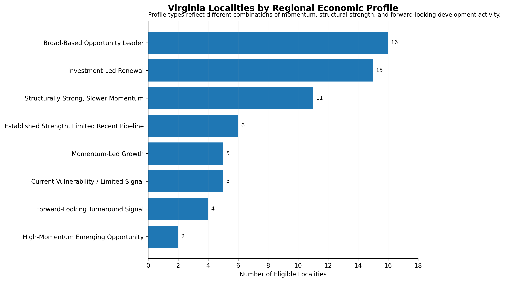

# Virginia Regional Economic Intelligence

A reproducible applied regional-economics and data-science project examining economic momentum, industry structure, competitive performance, and forward-looking development signals across Virginia localities.

The project combines historical **Quarterly Census of Employment and Wages (QCEW)** data with structured information extracted from **Virginia Economic Development Partnership (VEDP)** business-investment announcements to build a transparent framework for regional economic analysis.

## Research Question

> Which Virginia localities show the strongest combination of recent economic momentum, competitive industry performance, structural economic strengths, and forward-looking development signals—and where do the data suggest emerging opportunities or vulnerabilities?

## Project Scope

The analysis covers Virginia counties and independent cities and integrates:

- historical employment and wage trends;
- industry specialization and diversification;
- shift-share competitive effects;
- announced business investment and job creation;
- document intelligence and NLP;
- and a final Regional Economic Opportunity Framework.


## Key Findings

- **Richmond city ranks first overall** in the Regional Economic Opportunity Framework, followed by Stafford County, Goochland County, Chesterfield County, Frederick County, and Chesapeake city.
- Among localities with sufficiently reliable data, **16 are classified as Broad-Based Opportunity Leaders**, scoring above average in momentum, structural strength, and forward development.
- **15 localities are classified as Investment-Led Renewal**, indicating weaker recent momentum but stronger structural foundations and meaningful recent development activity.
- Virginia's matched private-sector employment increased from approximately **2.81 million jobs in 2019 to 2.90 million in 2025**, a gain of about **2.9%**.
- Strong positive locality competitive effects were observed in places including **Loudoun County, Suffolk city, Stafford County, Prince William County, Richmond city, Chesterfield County, and Frederick County**.
- The VEDP document-intelligence workflow identified **87 business investment projects**, of which **83 could be assigned to a single Virginia locality** for regional analysis.
- The final ranking is robust to alternative weighting assumptions, with Spearman rank correlations of **0.983** under a momentum-focused scenario and **0.957** under a forward-development-focused scenario.


## Visual Highlights

### Regional Economic Opportunity Ranking



The highest-ranked localities combine different mixes of recent economic momentum, structural strength, and forward-looking development activity.

### Regional Opportunity Landscape



This view compares economic momentum and structural strength across eligible localities, with point size representing the strength of recent forward-looking development activity.

### Regional Economic Profiles



The profile framework distinguishes broad-based leaders from investment-led renewal, momentum-led growth, turnaround signals, structural strength, and areas with more limited current signals.

## Methodology and Notebook Workflow

The project is organized as a five-notebook analytical pipeline:

1. **`01_data_acquisition.ipynb`**  
   Downloads and prepares annual BLS QCEW data for 2019–2025 and constructs the Virginia private-sector locality-industry panel.

2. **`02_data_quality.ipynb`**  
   Evaluates analytical readiness, suppression, missingness, year-over-year changes, wage outliers, and other data-quality issues before downstream analysis.

3. **`03_regional_economic_analysis.ipynb`**  
   Examines employment growth, wage trends, location quotients, industry specialization, and shift-share competitive effects across Virginia localities.

4. **`04_document_intelligence.ipynb`**  
   Extracts and structures VEDP business-investment announcements, classifies sectors and strategic themes, applies NLP topic modeling, and connects project announcements to locality-level QCEW context.

5. **`05_regional_economic_opportunity_framework.ipynb`**  
   Integrates historical momentum, structural economic characteristics, and forward-looking development signals into a transparent Regional Economic Opportunity Framework, including sensitivity analysis and locality profile classification.

### Final Framework Dimensions

The Regional Economic Opportunity Framework combines three standardized dimensions:

- **Economic Momentum** — employment growth and shift-share competitive performance;
- **Structural Strength** — industry specialization breadth and economic diversification;
- **Forward Development** — announced investment, announced jobs, and project activity.

The baseline composite weights are:

- **40% Economic Momentum**
- **35% Structural Strength**
- **25% Forward Development**

Alternative weighting scenarios are also evaluated to test ranking stability.


## Data Sources

### Bureau of Labor Statistics — QCEW

The historical regional-economy analysis uses annual **Quarterly Census of Employment and Wages (QCEW)** data for **2019–2025**.

The final analytical panel focuses on:

- Virginia counties and independent cities;
- private-sector employment;
- broad NAICS industry sectors;
- annual average employment;
- establishments;
- and wage measures.

Because QCEW suppresses some locality-industry observations for confidentiality, the project explicitly tracks data availability and applies coverage thresholds where needed.

### Virginia Economic Development Partnership — Business Announcements

Forward-looking development signals are derived from **VEDP business-investment announcements published from January 2025 through August 2026**.

The document-intelligence workflow extracts and structures information including:

- company;
- locality;
- announced investment;
- announced jobs;
- industry;
- strategic theme;
- and project context.

These announcements are treated as forward-looking development signals rather than realized economic outcomes.

## Repository Structure

```text
virginia-regional-economic-intelligence/
│
├── data/
│   ├── raw/
│   │   └── Source QCEW archives and supporting geographic data
│   │
│   └── processed/
│       └── Cleaned and quality-enriched analytical panels
│
├── notebooks/
│   ├── 01_data_acquisition.ipynb
│   ├── 02_data_quality.ipynb
│   ├── 03_regional_economic_analysis.ipynb
│   ├── 04_document_intelligence.ipynb
│   └── 05_regional_economic_opportunity_framework.ipynb
│
├── outputs/
│   ├── figures/
│   │   └── Final analytical visualizations
│   │
│   └── tables/
│       └── Validation, analytical, and framework outputs
│
├── README.md
└── requirements.txt
```


## Limitations

Several limitations should be considered when interpreting the results:

- **QCEW suppression:** some locality-industry observations are unavailable because of confidentiality protections, which can affect measures of diversification and specialization.
- **Locality scale:** counties and independent cities vary substantially in employment base and economic structure; minimum employment thresholds are therefore used for comparative ranking.
- **Broad industry aggregation:** the analysis uses broad NAICS sectors, which improves comparability but can mask important differences within industries.
- **VEDP announcements are forward-looking signals:** announced investment and jobs may be delayed, modified, or not fully realized.
- **Composite weights involve judgment:** the final opportunity score uses transparent baseline weights rather than statistically estimated causal weights. Sensitivity analysis is included to test the robustness of rankings.
- **Localities are administrative geographies:** economic activity frequently crosses county and city boundaries, so the framework should not be interpreted as a substitute for metropolitan, commuting-zone, or input-output analysis.
- **The framework is descriptive, not causal:** observed relationships identify regional patterns and signals but do not establish that any individual policy, investment, or industry caused subsequent economic performance.

## Reproducibility

The notebooks are designed to be run sequentially from `01` through `05`.

Install the required Python packages with:

```bash
pip install -r requirements.txt
```

The workflow then proceeds through:

```text
01_data_acquisition
        ↓
02_data_quality
        ↓
03_regional_economic_analysis
        ↓
04_document_intelligence
        ↓
05_regional_economic_opportunity_framework
```

Intermediate datasets are written to `data/processed/`, while analytical tables and figures are saved under `outputs/`.

Because Notebook 04 retrieves public VEDP web content, results from a future rerun may differ if source pages are edited, removed, or new announcements are published.
